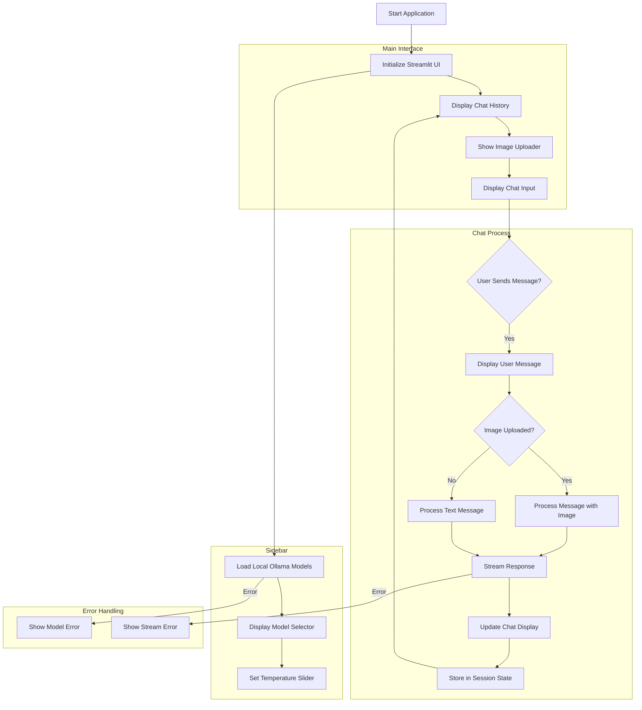

# Ollama Chat with Streamlit

A Streamlit-based chat interface for Ollama models with image support.

## Environment Setup (Windows)

1. Install Python (3.8 or higher)
   
   Download and install from https://www.python.org/downloads/
   

2. Install Git
   
   Download and install from https://git-scm.com/download/win
   

3. Install Ollama
   
   Download and install from https://ollama.ai/download
   

4. Clone the repository
   
   git clone https://github.com/Arin1599/Streamlit_ollama.git
   cd ollama_chat
   

5. Create a virtual environment
   
   python -m venv venv
   

6. Activate the virtual environment
   
   .\venv\Scripts\activate
   

7. Install required packages
   
   pip install -r requirements.txt
   

## Running the Application

1. Start Ollama server
   
   ollama serve
   

2. Pull desired models (example)
   
   ollama pull qwen2.5:latest
   

3. Activate virtual environment (if not already activated)
   
   .\venv\Scripts\activate
   

4. Run the Streamlit app
   
   streamlit run app.py
   

## Requirements
- Python 3.8+
- Streamlit
- Ollama
- Pillow (PIL)
- requests

## Note
Make sure Ollama server is running before starting the Streamlit application. The default address for Ollama server is http://localhost:11434

# A flow diagram of the streamlit app

