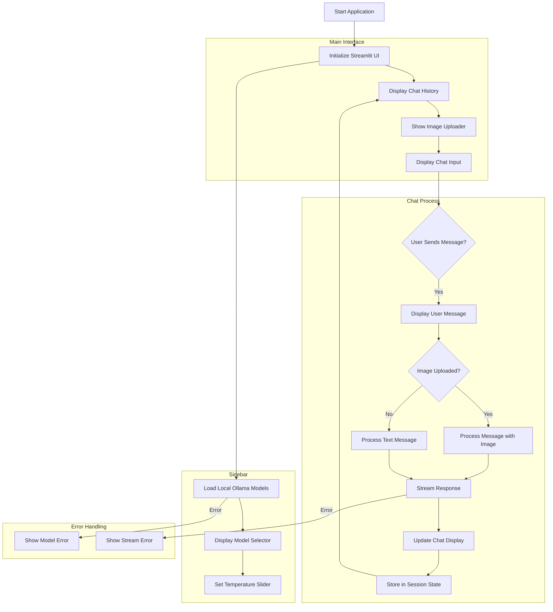

```mermaid
flowchart TD
    A[Start Application] --> B[Initialize Streamlit UI]
    B --> C[Load Local Ollama Models]
    
    subgraph Sidebar
        C --> D[Display Model Selector]
        D --> E[Set Temperature Slider]
    end
    
    subgraph Main Interface
        B --> F[Display Chat History]
        F --> G[Show Image Uploader]
        G --> H[Display Chat Input]
    end
    
    subgraph Chat Process
        H --> I{User Sends Message?}
        I -->|Yes| J[Display User Message]
        J --> K{Image Uploaded?}
        K -->|Yes| L[Process Message with Image]
        K -->|No| M[Process Text Message]
        
        L --> N[Stream Response]
        M --> N
        
        N --> O[Update Chat Display]
        O --> P[Store in Session State]
        P --> F
    end
    
    subgraph Error Handling
        C -->|Error| Q[Show Model Error]
        N -->|Error| R[Show Stream Error]
    end
```